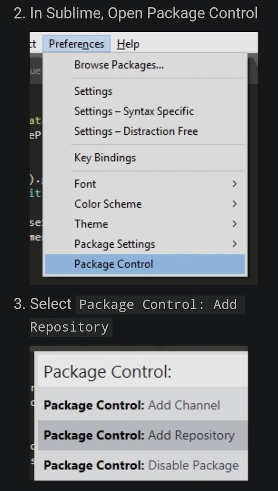

## Cài đặt thông thường



Add `https://github.com/telexyz/bon-sublime.git`

Sau đó vào `Package Control: Install Package` và tìm `bon-sublime` để cài đặt.

## Cài đặt locally để phát triển
```
git clone https://github.com/telexyz/bon-sublime.git
ln -s ~/repos/bon-sublime ~/Library/Application\ Support/Sublime\ Text/Packages/
```
